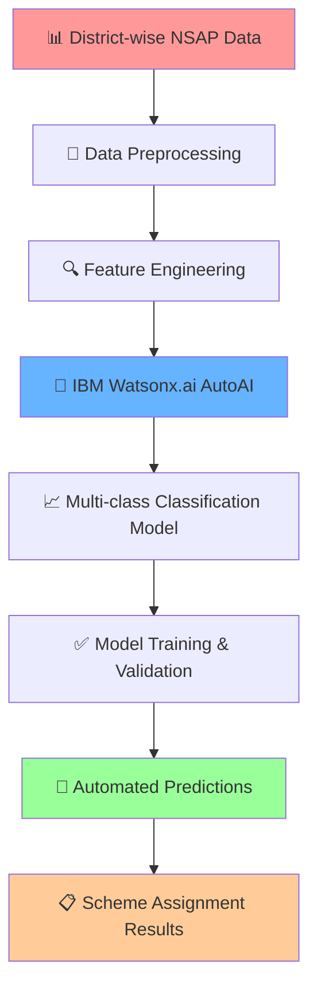

# ✨ NSAP Eligibility Predictor: Revolutionizing Social Assistance with AI 🚀

<div align="center">


</div>

---

## 💡 **Introduction**

This project aims to enhance the efficiency and accuracy of the **National Social Assistance Program (NSAP)** by leveraging machine learning. By automating the process of predicting applicant eligibility for various NSAP schemes, we strive to ensure timely and precise delivery of financial aid to vulnerable groups across India. 

This solution was developed using **IBM Watsonx.ai Studio**, demonstrating the power of automated machine learning (AutoAI) in real-world applications.

<div align="center">

</div>

---

## 🎯 **Problem Statement**

The **National Social Assistance Program (NSAP)** is a crucial government initiative designed to provide social security and financial assistance to vulnerable groups, including the elderly, widows, and persons with disabilities. 

### 🚨 **Current Challenges:**
- **Manual Verification Process**: Time-consuming and labor-intensive
- **Human Error**: Prone to mistakes in scheme assignment
- **Processing Delays**: Significant delays in application processing
- **Inconsistent Decisions**: Lack of standardized evaluation criteria

This often leads to significant delays and can result in deserving individuals not receiving the timely support they need.

<div align="center">

</div>

---

## 🌟 **Proposed Solution**

Our proposed system addresses the challenge of manually verifying NSAP applications by employing machine learning to accurately and efficiently predict the appropriate scheme for each applicant. This automates decision-making, reduces human error, and ensures timely delivery of financial aid.

### 🔧 **Key Components:**

<div align="center">

| Component | Description | Technology |
|-----------|-------------|------------|
| **📊 Data Collection** | District-wise NSAP pension data with demographic and socio-economic factors | IBM Watsonx.ai |
| **🧹 Data Preprocessing** | Clean and prepare data, handle missing values and outliers | IBM AutoAI |
| **🤖 ML Algorithm** | Multi-class classification model for scheme prediction | IBM Watsonx.ai Studio |
| **⚡ Automation** | End-to-end automated decision-making pipeline | AutoAI Feature |

</div>

---

## 🛠️ **Technology Stack**

<div align="center">

### **IBM Cloud Platform**


</div>

---

## 🏗️ **System Architecture**

<div align="center">

</div>



---

## 📊 **Data Components**

### 🗂️ **Input Features:**
- **Demographics**: Gender, Age, Caste
- **Socio-economic**: Income levels, family composition
- **Geographic**: District-wise distribution data
- **Social Factors**: Marital status, disability status
- **Historical Data**: Previous NSAP beneficiary records

### 🎯 **Target Variable:**
Multi-class classification for NSAP scheme eligibility prediction

<div align="center">

</div>

---

## 🚀 **Implementation Process**

### **Phase 1: Data Collection & Preparation**
```
✅ Gather district-wise NSAP pension data
✅ Extract demographic and socio-economic factors
✅ Ensure data quality and completeness
```

### **Phase 2: Data Preprocessing**
```
✅ Handle missing values and outliers
✅ Clean and format data for model training
✅ Feature engineering and selection
```

### **Phase 3: Model Development**
```
✅ Implement multi-class classification using IBM Watsonx.ai Studio
✅ Utilize AutoAI for automated model building
✅ Optimize model performance and accuracy
```

### **Phase 4: Deployment & Integration**
```
✅ Deploy model on IBM Cloud
✅ Create automated prediction pipeline
✅ Integrate with NSAP application system
```

<div align="center">

</div>

---

## 🎯 **Expected Benefits**

<div align="center">

| Benefit | Impact | Measurement |
|---------|--------|-------------|
| **⚡ Processing Speed** | Instant eligibility decisions | Minutes vs. Days |
| **🎯 Accuracy** | Reduced human error | Higher precision rates |
| **💰 Cost Efficiency** | Lower operational costs | Resource optimization |
| **📈 Scalability** | Handle large volumes | Automated processing |
| **🔄 Consistency** | Standardized decisions | Uniform criteria |

</div>

---

## 🔬 **IBM Watsonx.ai Studio Features Utilized**

### **AutoAI Capabilities:**
- **Automated Data Preparation**: Intelligent preprocessing
- **Algorithm Selection**: Best model identification  
- **Hyperparameter Optimization**: Performance tuning
- **Model Validation**: Cross-validation and testing
- **Deployment Ready**: Production-ready models

<div align="center">

</div>

---

## 📈 **Project Impact**

### **Social Impact:**
- **Faster Aid Delivery**: Reducing wait times for vulnerable populations
- **Improved Accuracy**: Ensuring deserving candidates receive appropriate schemes
- **Enhanced Transparency**: Automated, bias-free decision making
- **Better Resource Allocation**: Optimal distribution of government resources

### **Technical Achievement:**
- **AI-Powered Government Services**: Modernizing social assistance programs
- **Scalable Solution**: Replicable across different states and programs
- **IBM Cloud Integration**: Leveraging enterprise-grade AI platform

<div align="center">

</div>

---

## 🏆 **Innovation Highlights**

<div align="center">

**🤖 First AI-powered NSAP eligibility system**  
**⚡ Real-time processing capabilities**  
**🎯 Multi-scheme classification accuracy**  
**🔗 IBM Watsonx.ai Studio integration**  
**📊 Data-driven social assistance**

</div>

---

## 🔮 **Future Enhancements**

- **Real-time Data Integration**: Live updates from government databases
- **Mobile Application**: Direct applicant interface
- **Multi-language Support**: Regional language processing
- **Advanced Analytics**: Trend analysis and forecasting
- **Integration Expansion**: Connect with other social welfare programs

<div align="center">

</div>

---

<div align="center">

**🚀 Revolutionizing Social Assistance with IBM AI**


**Powered by IBM Watsonx.ai Studio AutoAI**

</div>
